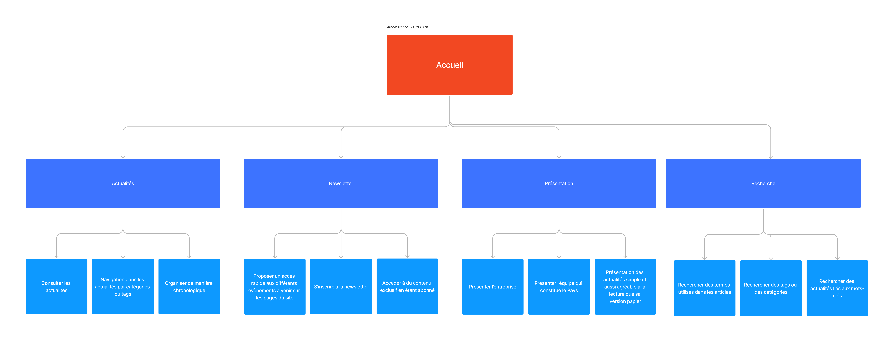

# Cahier des charges - Le Pays NC

Salut! Je suis le cahier des charges pour **l'ECF4**. Si vous avez des questions, veuillez contacter mon chef Grégory SAÏMOEN, en vous remerciant, bonne lecture !

# Sommaire
- Introduction
- Les raisons de la création du site pour le Pays
- Exigences et contraintes
- Persona

## Introduction

Le journal local “Le Pays” souhaite se moderniser et créer un site internet pour relayer les informations de sa version papier. Monsieur Do le directeur du journal, est très attaché au papier et au confort de lecture que peut fournir ce support. Il souhaite donc que le site soit simple d’utilisation et aussi agréable à la lecture que sa version papier. Le journal a pour réputation de relayer les activités sportives et culturelles du pays.

## Pourquoi la création du site web ?

- Pour une meilleure expérience utilisateur : Monsieur Do souhaite rendre ce site internet accessible sur mobile, car il veut atteindre des lecteurs plus jeunes et familiarisés avec la technologie.
- Le journal local “Le Pays” souhaite se moderniser et créer un site internet pour relayer les informations de sa version papier.
- Augmentation des ventes : Les utilisateurs sont plus susceptibles d'acheter un article s'ils peuvent le réserver immédiatement
- Ensuite, le site peut aider à réduire les pertes de vente en raison d'annulations. Les utilisateurs qui ont réservé un produit sont plus engagés dans leur achat, car ils ont pris une décision d'achat.

## Exigences & contraintes
### Exigences :
- Proposer un accès rapide aux différents évènements à venir sur les pages du site.
- Les articles de presse doivent être faciles à consulter ou à trouver
- La taxonomie du site devra permettre de naviguer dans les contenus de manière intuitive par catégories ou à l’aide de tags
- Le site doit être simple d’utilisation et aussi agréable à la lecture que sa version papier
- Conserver le rôle premier du site qui est d’informer et de présenter les informations de manière chronologique pour prioriser la une des informations du jour
- Enfin, monsieur Do souhaite rendre ce site internet accessible sur mobile, car il veut atteindre des lecteurs plus jeunes et familiarisés avec la technologie.

### Contraintes:
- Respecter la charte graphique : Il est important de suivre la charte graphique pour assurer une image de marque cohérente et professionnelle. En utilisant la même palette de couleurs, les mêmes typographies et les mêmes styles visuels sur tous les supports, une entreprise peut se démarquer et renforcer sa présence visuelle.
- Les contraintes de temps : Respecter une limite de temps est crucial pour garantir l'efficacité et la productivité. Lorsque vous avez une tâche à accomplir dans un temps imparti, il est important de vous concentrer sur les éléments clés de cette tâche et de travailler de manière méthodique et organisée.
- Les contraintes techniques : Il peut y avoir des limites techniques sur les choix de techniques sur le choix de technologies, de fonctionnalités, d’infrastructure ou encore des contraintes de sécurité qui doivent être prises en compte.

## L’arborescence du site

## Persona

<!-- Notes sur le theme.json -->
Settings: Permet de définir les blocs de contrôle et la palette de couleur, la taille de la police etc..

Styles: Permet d'appliquer les couleurs et la taille de la police au site et au bloc